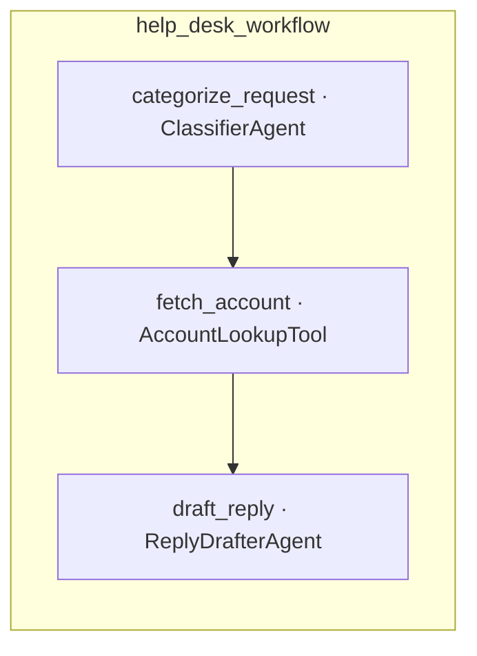

# Workflows

Workflows compose multiple steps into a sequential pipeline. Each step declares its input and output contract, and data flows from one step to the next. The workflow returns a structured result that communicates success, failure, and per-step outcomes.

## When to Use Workflows

Use workflows when a task requires multiple deterministic steps that must run in sequence. If the task is a single LLM call, use an Agent directly. If you need to orchestrate parallel or branching logic, workflows are not the right fit (yet).

## Defining a Step

Create a step by subclassing `Riffer::Workflow::Step`:

```ruby
class CategorizeRequest < Riffer::Workflow::Step
  uses ClassifierAgent

  input do
    required :message, String
  end

  output do
    required :message, String
    required :category, String
    required :priority, String
  end

  def execute(message:)
    response = ClassifierAgent.generate(message)
    parsed = JSON.parse(response.content, symbolize_names: true)

    {message: message, category: parsed[:category], priority: parsed[:priority]}
  end
end
```

### input / output

Declare what the step expects and what it returns using the same `Riffer::Params` DSL that tools use:

```ruby
class FetchAccount < Riffer::Workflow::Step
  uses AccountLookupTool

  input do
    required :message, String
    required :category, String
    required :priority, String
  end

  output do
    required :message, String
    required :category, String
    required :priority, String
    required :account_summary, String
  end

  def execute(message:, category:, priority:)
    tool = AccountLookupTool.new
    response = tool.call(context: nil, patient_id: context[:patient_id])

    {message: message, category: category, priority: priority, account_summary: response.content}
  end
end
```

Both blocks are optional. Without them, the framework skips validation for that boundary.

### identifier

Sets a custom identifier. Defaults to the snake_case class name:

```ruby
class CategorizeRequest < Riffer::Workflow::Step
  identifier "categorize"
end

CategorizeRequest.identifier  # => "categorize"
```

Without an explicit override, `CategorizeRequest.identifier` returns `"categorize_request"`.

### uses

Declares agents or tools the step depends on. Optional, used by `to_mermaid` and `describe` for visualization:

```ruby
class CategorizeRequest < Riffer::Workflow::Step
  uses ClassifierAgent
  # ...
end
```

### execute

The only method you must implement. It receives validated keyword arguments and must return a Hash matching the output contract:

```ruby
def execute(message:)
  {message: message.strip, category: "general", priority: "normal"}
end
```

### context

Inside `execute`, `self.context` gives access to the workflow-level context hash for cross-cutting data that shouldn't flow through step I/O:

```ruby
def execute(category:, priority:)
  patient_id = context[:patient_id]
  # ...
end
```

## Defining a Workflow

Declare a workflow by subclassing `Riffer::Workflow` and registering steps with the `step` macro:

```ruby
class HelpDeskWorkflow < Riffer::Workflow
  step CategorizeRequest
  step FetchAccount
  step DraftReply
end
```

Steps run in the order they are declared. The first step receives the workflow input. Each subsequent step receives the previous step's output.

## Running a Workflow

```ruby
# Class convenience
result = HelpDeskWorkflow.execute(
  {message: "I can't log in and my appointment is in an hour"},
  context: {patient_id: "patient_123", clinic_id: "jane_demo"}
)

# Instance form
workflow = HelpDeskWorkflow.new(context: {patient_id: "patient_123"})
result = workflow.execute(message: "I can't log in...")
```

## Data Flow

Each step's output becomes the next step's input:

```
{ message: "I can't log in..." }
  → CategorizeRequest → { message: "...", category: "account_access", priority: "urgent" }
  → FetchAccount      → { message: "...", category: "...", priority: "...", account_summary: "..." }
  → DraftReply        → { reply: "Hi! I can see your account...", escalate: false }
```

Steps must pass through any data the next step needs.

## Result

`Riffer::Workflow::Result` is a value object returned by `execute`:

| Attribute | Type | Description |
|---|---|---|
| `status` | Symbol | `:success` or `:failed` |
| `input` | Hash | The original input passed to the workflow |
| `output` | Hash | Final step's output (nil on failure) |
| `error` | StandardError | The captured exception (nil on success) |
| `failed_step` | String | Identifier of the failed step (nil on success) |
| `steps` | Hash | Per-step `StepResult` objects keyed by identifier |
| `success?` | Boolean | Whether the workflow completed |
| `failed?` | Boolean | Whether a step failed |

### StepResult

Each entry in `result.steps` is a `Riffer::Workflow::StepResult`:

| Attribute | Type | Description |
|---|---|---|
| `status` | Symbol | `:success`, `:failed`, or `:pending` |
| `payload` | Hash | The input received by this step |
| `output` | Hash | The output produced (nil unless success) |
| `error` | StandardError | The captured exception (nil unless failed) |

Steps that didn't run because a prior step failed have `status: :pending`.

### Serialization

Call `to_h` on the result for a full snapshot:

```ruby
result = HelpDeskWorkflow.execute(
  {message: "I can't log in"},
  context: {patient_id: "patient_123"}
)

result.to_h
# => {
#   status: :success,
#   input: { message: "I can't log in" },
#   output: { reply: "Hi! I can see...", escalate: false },
#   steps: {
#     "categorize_request" => {
#       status: :success,
#       payload: { message: "I can't log in" },
#       output: { message: "...", category: "account_access", priority: "urgent" }
#     },
#     "fetch_account" => {
#       status: :success,
#       payload: { message: "...", category: "account_access", priority: "urgent" },
#       output: { message: "...", category: "...", priority: "...", account_summary: "..." }
#     },
#     "draft_reply" => {
#       status: :success,
#       payload: { message: "...", category: "...", priority: "...", account_summary: "..." },
#       output: { reply: "Hi! I can see...", escalate: false }
#     }
#   }
# }
```

### Per-step inspection

```ruby
result.steps.each do |step_id, step_result|
  case step_result.status
  when :success then puts "#{step_id}: #{step_result.output}"
  when :failed  then puts "#{step_id}: #{step_result.error.message}"
  when :pending then puts "#{step_id}: did not run"
  end
end
```

## Error Handling

Workflows fail fast. When a step fails, the workflow stops and remaining steps are marked `:pending`. Errors during step execution are captured in the result, not raised to the caller.

Three failure modes:

1. **Input validation** - a step's input doesn't match its `input` declaration. Captured as `Riffer::ValidationError`.
2. **Execution error** - `execute` raises an exception. The original exception is captured.
3. **Output validation** - a step's return value doesn't match its `output` declaration. Captured as `Riffer::ValidationError`.

```ruby
result = HelpDeskWorkflow.execute({message: "I can't log in..."}, context: {patient_id: "p1"})

if result.failed?
  puts result.failed_step   # => "fetch_account"
  puts result.error.message # => "connection refused"
end
```

## Visualization

Two class methods help you inspect a workflow's shape without running it.

### describe

Prints a text summary to stdout:

```ruby
HelpDeskWorkflow.describe
# help_desk_workflow (3 steps)
#   1. categorize_request  [message] → [message, category, priority]  · ClassifierAgent
#   2. fetch_account       [message, category, priority] → [message, category, priority, account_summary]  · AccountLookupTool
#   3. draft_reply         [message, category, priority, account_summary] → [reply, escalate]  · ReplyDrafterAgent
```

### to_mermaid

Returns a Mermaid flowchart string. GitHub, Notion, and Obsidian render it natively in markdown:

```ruby
puts HelpDeskWorkflow.to_mermaid
```



## Using Agents and Tools in Steps

Steps call agents and tools directly. Any exception they raise is captured by the runner, the workflow stops, and the error surfaces in the result:

```ruby
class DraftReply < Riffer::Workflow::Step
  uses ReplyDrafterAgent

  input do
    required :message, String
    required :category, String
    required :priority, String
    required :account_summary, String
  end

  output do
    required :reply, String
    required :escalate, Riffer::Params::Boolean
  end

  def execute(message:, category:, priority:, account_summary:)
    prompt = "Draft a #{priority} #{category} reply.\nMessage: #{message}\nAccount: #{account_summary}"
    response = ReplyDrafterAgent.generate(prompt)
    parsed = JSON.parse(response.content, symbolize_names: true)

    {reply: parsed[:reply], escalate: parsed[:escalate]}
  end
end
```
